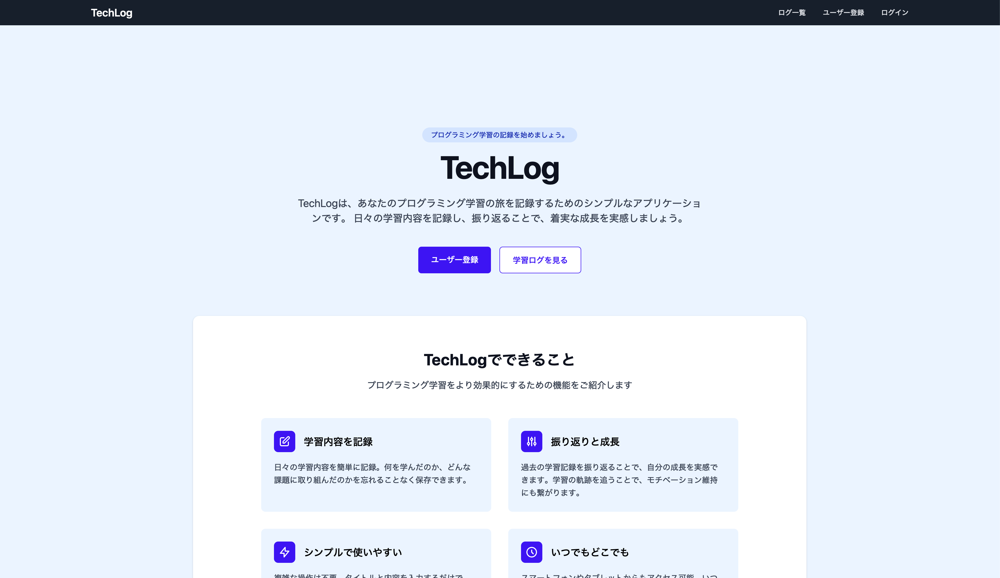
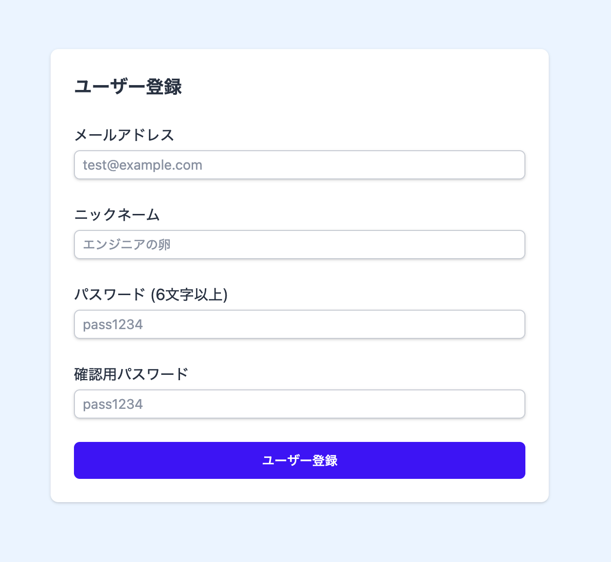
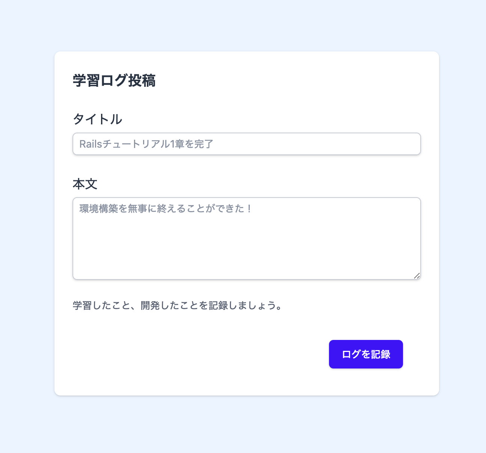
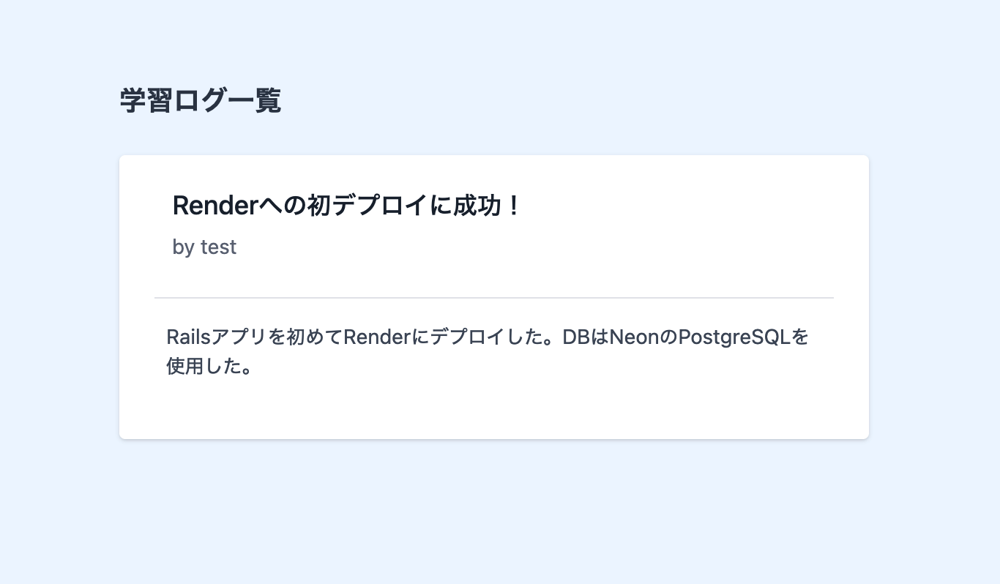

# TechLog

プログラミングの学習記録を投稿・共有できる Web アプリケーションです。

Udemy コース「[未経験からはじめる Ruby on Rails！Ruby / RSpec も学びながらポートフォリオ公開まで一本で完結](https://www.udemy.com/course/ruby-on-rails-rspec/)」の教材として作成しました。

## 技術スタック

| カテゴリ | 技術 |
|---------|------|
| バックエンド | Ruby 3.4.5 / Rails 8.1.2 |
| フロントエンド | Tailwind CSS / Hotwire (Turbo + Stimulus) |
| 認証 | Devise |
| データベース | SQLite3 (開発・テスト) / PostgreSQL (本番) |
| テスト | RSpec / Capybara / FactoryBot / Selenium |
| Lint | RuboCop |
| CI | GitHub Actions |
| デプロイ | Render / Neon (PostgreSQL) |

## 機能紹介

### トップページ

アプリのランディングページです。

### ユーザー登録

ニックネーム・メールアドレス・パスワードを入力して新規登録できます。

### ログイン

メールアドレスとパスワードでログインします。

### 学習ログ投稿

ログインユーザーはタイトルと内容を入力して学習ログを投稿できます。

### 学習ログ一覧

投稿された学習ログを新着順に一覧表示します。

## 今後の改善予定

- [ ] **OAuth 認証の導入** — Gmail や GitHub による OAuth ログインを追加し、認証のセキュリティと利便性を強化する
- [ ] **メール認証 (Confirmable)** — 登録時にメール確認を必須にし、実在しないアドレスでの登録を防止する
- [ ] **パスワード強度の強化** — 大文字・数字・記号を含む要件を追加する
- [ ] **二要素認証 (2FA)** — TOTP（Google Authenticator 等）による二段階認証を導入する
- [ ] **CORS 設定** — API 追加に備えて、許可するオリジンを明示的に設定する
- [ ] **CI/CD の改善** — GitHub Actions に RuboCop・RSpec の自動実行を追加。CircleCI への移行も検討
- [ ] **UI の改善** — デザインをよりモダンに刷新する（レスポンシブ対応の強化、ダークモード対応など）
- [ ] **多言語対応 (i18n)** — 日本語と英語の切り替えトグルを実装し、英語版を追加する
- [ ] **学習ログの検索・フィルタリング** — タイトルや投稿者での検索機能を追加する
- [ ] **タグ・カテゴリ機能** — 学習ログにタグを付けて分類できるようにする
- [ ] **ページネーション** — 一覧ページにページ送りを実装する
- [ ] **Markdown 対応** — 学習ログの本文を Markdown で記述・表示できるようにする